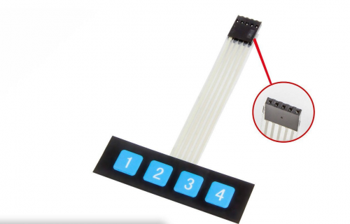
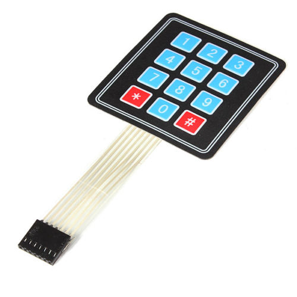

# DAKboardExtensions

The aim of this project is to provide more features
to the DAKboard (raspberry pi version). The DAK board is
an amazing wifi connected wall display for your photos,
calendar, news and weather.
Create your own DAKboard, a beautiful wall display for your photos,
calendar, news and weather, powered by a Raspberry Pi!
https://dakboard.com

Yup, I'm cheating. My project is not really an extension.
I am just finding a way to switch chromium tabs or application
with an external hardware. External Keybord connected to the 
raspberry in the mean time.

## The idea
The DAKboard is very useful and estheticaly perfect but I am expecting
more information from a dashboard. Let's say traffic, specific wind forcast,
trades and so one. DAKboard is actually running a Chromium tab in full
screen mode. Nothing else complicated. What about to open new tabs with
websites to display?

## Technicaly
Arduino Leonardo or Arduino micro are similar to an Arduino UNO,
but they can be recognized by computer as a mouse or keyboard.
All the boards embedding an ATmega32u4. This is not the case of the arduino UNO.
https://store.arduino.cc/arduino-leonardo-with-headers

It is very easy to send keyboard keycode to the raspberry/chromium from
an external keyboard plugged to the arduino GPIOs.
Let's talk about a 4 keys flexible keyboard to stick in front of the display.
Like this one:

## Setup a free DAKboard based on Raspberry pi

The full setup of the raspberry pi to run DAKboard is detailed here:
https://dakboard.com/blog/diy-wall-display/

## 
To be continued ...
